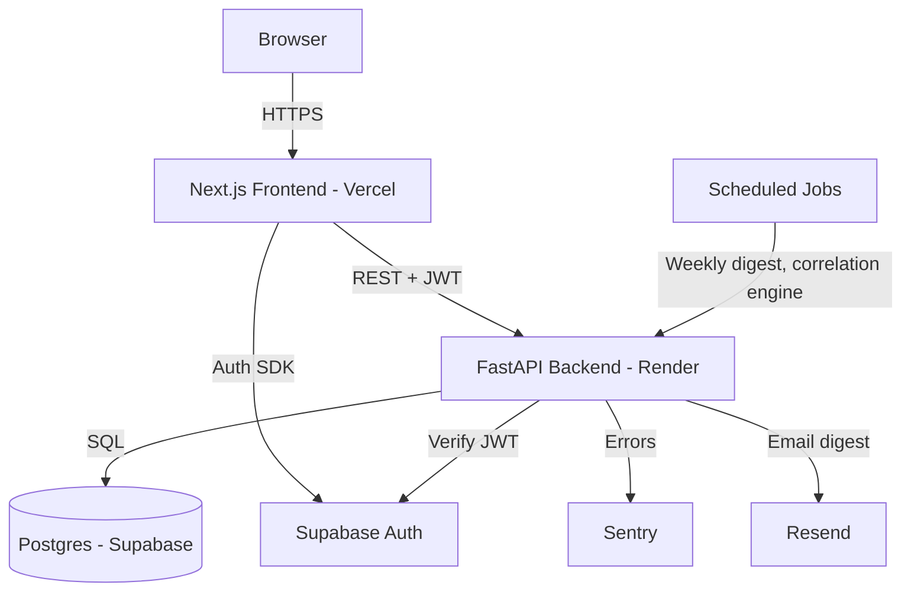
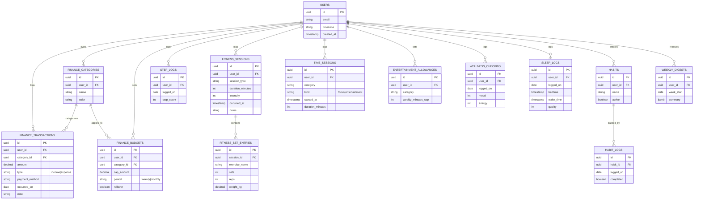

# Developer Guide — Ultimate Tracker

This document is the technical reference for building Ultimate Tracker. Read this before writing code.

## Table of Contents

1. [Architecture Overview](#1-architecture-overview)
2. [Tech Stack & Rationale](#2-tech-stack--rationale)
3. [Repository Structure](#3-repository-structure)
4. [Domain Model & Database Schema](#4-domain-model--database-schema)
5. [API Design Conventions](#5-api-design-conventions)
6. [Features & Functional Requirements](#6-features--functional-requirements)
7. [Local Development Setup](#7-local-development-setup)
8. [Branching Strategy & Git Workflow](#8-branching-strategy--git-workflow)
9. [CI/CD Pipeline](#9-cicd-pipeline)
10. [Testing Strategy](#10-testing-strategy)
11. [Coding Standards & Linting](#11-coding-standards--linting)
12. [Observability & Monitoring](#12-observability--monitoring)
13. [Security Notes](#13-security-notes)
14. [Release Plan](#14-release-plan)
15. [Future Considerations](#15-future-considerations)

---

## 1. Architecture Overview

Ultimate Tracker is a **decoupled web app**: a Next.js frontend talks to a FastAPI backend over REST, and both rely on Supabase for Postgres and authentication.



**Why decoupled instead of Next.js full-stack (API routes)?**
Because FastAPI gives you async-native Python, automatic OpenAPI docs, and a clean place to put the correlation engine and scheduled jobs — logic that doesn't belong wedged into Next.js API routes. It also mirrors how most real backend teams are structured, which matters for a portfolio piece.

**Auth flow:**
1. User signs up/logs in via Supabase Auth SDK in the frontend.
2. Supabase issues a JWT.
3. Frontend attaches the JWT as a Bearer token on every request to FastAPI.
4. FastAPI verifies the JWT against Supabase's public key (no separate auth database needed).

---

## 2. Tech Stack & Rationale

| Choice | Rationale |
|---|---|
| **Next.js 14 (App Router)** | Server components reduce client JS, good defaults for SEO and load speed |
| **TypeScript** everywhere on frontend | Catches schema mismatches with the API at compile time |
| **Tailwind + shadcn/ui** | No time wasted on a design system; shadcn components are copy-in, not a dependency lock-in |
| **FastAPI** | Async-first, Pydantic validation built in, auto-generated OpenAPI docs at `/docs` |
| **SQLAlchemy 2.0 (async) + Alembic** | Explicit migrations, no magic — important when the schema spans 7 domains |
| **Supabase (Postgres + Auth)** | Free tier is generous (500MB DB, 50k monthly active users), removes the need to build auth from scratch |
| **Render (backend)** | Free tier supports Docker deploys; spins down after inactivity but wakes on request — acceptable for a personal project |
| **Vercel (frontend)** | Zero-config Next.js deploys, generous free tier, preview deployments per PR |
| **GitHub Actions** | Free for public repos, native PR integration |
| **Sentry** | Free tier (5k errors/month) is enough for a personal project, catches real bugs before you notice |

---

## 3. Repository Structure

```
ultimate-tracker/
├── frontend/
│   ├── app/
│   │   ├── (auth)/login/
│   │   ├── (auth)/signup/
│   │   ├── dashboard/
│   │   ├── finance/
│   │   ├── steps/
│   │   ├── fitness/
│   │   ├── time/
│   │   ├── wellness/
│   │   ├── insights/
│   │   ├── settings/
│   │   └── onboarding/
│   ├── components/
│   │   ├── ui/              # shadcn primitives
│   │   ├── charts/
│   │   └── shared/
│   ├── lib/
│   │   ├── api-client.ts    # typed fetch wrapper for FastAPI
│   │   ├── supabase.ts
│   │   └── hooks/
│   ├── tests/
│   ├── package.json
│   └── tailwind.config.ts
│
├── backend/
│   ├── app/
│   │   ├── api/
│   │   │   └── v1/
│   │   │       ├── auth.py
│   │   │       ├── finance.py
│   │   │       ├── steps.py
│   │   │       ├── fitness.py
│   │   │       ├── time_tracking.py
│   │   │       ├── wellness.py
│   │   │       └── insights.py
│   │   ├── core/             # config, security, JWT verification
│   │   ├── db/                # session, base model
│   │   ├── models/             # SQLAlchemy ORM models
│   │   ├── schemas/            # Pydantic request/response schemas
│   │   ├── services/           # business logic per domain
│   │   ├── tasks/               # scheduled jobs (digest, correlation engine)
│   │   └── main.py
│   ├── alembic/
│   │   └── versions/
│   ├── tests/
│   ├── requirements.txt
│   ├── Dockerfile
│   └── pyproject.toml          # ruff + mypy config
│
├── docs/
│   └── adr/                    # architecture decision records
├── .github/
│   ├── workflows/
│   │   ├── backend-ci.yml
│   │   ├── frontend-ci.yml
│   │   └── pr-title.yml        # Conventional Commits check on PR titles
│   ├── ISSUE_TEMPLATE/         # bug / feature / chore issue forms
│   ├── pull_request_template.md
│   └── dependabot.yml
├── docker-compose.yml
├── .pre-commit-config.yaml
├── .env.example
├── README.md
├── CONTRIBUTING.md
├── DeveloperGuide.md
└── CLAUDE.md
```

> There is no `deploy.yml` — Render and Vercel deploy natively on push to `main`. Don't re-add one.

**Pattern for adding a new domain feature:** model → schema → service → API route → test. Always in that order. Never write business logic directly in a route handler — it belongs in `services/`.

---

## 4. Domain Model & Database Schema



> Note: `USERS` mirrors Supabase's `auth.users` table via the user's UUID — we do not duplicate auth data, only reference the ID as a foreign key in a local `profiles` table for app-specific fields like `timezone`.

---

## 5. API Design Conventions

- All routes are versioned: `/api/v1/...`
- Resource-based REST naming: `GET /api/v1/finance/transactions`, `POST /api/v1/finance/transactions`, `PATCH /api/v1/finance/transactions/{id}`
- Auth: every protected route requires `Authorization: Bearer <supabase_jwt>`
- Pagination: cursor-based via `?limit=20&cursor=<id>` for list endpoints expected to grow large (transactions, sessions)
- Standard error shape:

```json
{
  "error": {
    "code": "BUDGET_NOT_FOUND",
    "message": "No budget exists for this category and period."
  }
}
```

- Dates always ISO 8601, timezone-aware. Server stores UTC; frontend converts to user's stored timezone for display.
- Every domain has a corresponding Pydantic schema split into `Create`, `Update`, and `Read` variants — never reuse one schema for all three.

---

## 6. Features & Functional Requirements

Condensed from the full planning session. Each item tagged **[Core]** (ship by v0.3) or **[Future]** (v0.4+).

### Finance & Budgeting
- **[Core]** Transaction logging — amount, category, date, note, payment method, recurring support
- **[Core]** Custom categories — CRUD, colour-coded, default presets on signup
- **[Core]** Budget rules engine — weekly/monthly cap per category, rollover option
- **[Core]** Budget breach alerts — web push at configurable thresholds (default 80%/100%)
- **[Core]** Spending dashboard — bar/pie charts, date range, month-over-month comparison
- **[Future]** CSV import with column mapping and duplicate detection
- **[Future]** Savings goals with progress tracking

### Steps & Walking
- **[Core]** Manual daily step logging with edit history
- **[Core]** Step goal with calendar heatmap (GitHub-style)
- **[Future]** Google Fit / Health Connect auto-sync via OAuth

### Fitness (Gym, Swimming, Sport)
- **[Core]** Session logger — type, duration, intensity, notes
- **[Core]** Exercise library + reusable templates, custom exercises
- **[Core]** Personal record (PR) auto-detection and history
- **[Core]** Progressive overload tracker with stagnation warnings
- **[Core]** Fitness dashboard — consistency heatmap, muscle group frequency

### Time Tracking
- **[Core]** Focus timer — start/pause/stop, category-tagged, no rigid Pomodoro constraint
- **[Core]** Entertainment budget — weekly allowance per category, remaining-time display, 80% warning
- **[Core]** Pre-defined + custom time categories (productive and leisure)
- **[Core]** Daily/weekly stacked time breakdown chart
- **[Future]** Android companion app for automatic screen time sync (out of scope for this project — web only)

### Wellness
- **[Core]** Daily mood + energy check-in (5-point scale, <5 seconds to complete)
- **[Core]** Sleep log — bedtime, wake time, quality rating, auto-calculated duration
- **[Core]** Custom habit tracker with streaks and completion rate
- **[Future]** Per-habit reminder notifications

### Cross-Domain Insights
- **[Core]** Weekly AI-generated digest — plain language summary, one actionable suggestion, email + in-app delivery
- **[Core]** Correlation engine — surfaces patterns only after minimum data threshold (3+ weeks), plain language explanations
- **[Core]** Insights dashboard — digest archive, saved/dismissed correlations
- **[Future]** Monthly deep-dive review, exportable as PDF

### Gaming Performance (Future — not in scope until v0.4+)
- Manual session logging (game, duration, result, self-rated performance)
- Riot API integration for LoL/Valorant match history
- Tilt detection heuristics (loss streaks, time-of-day performance decay)

### Platform & Core
- **[Core]** Auth — Supabase email/password + Google OAuth
- **[Core]** Dashboard home — per-domain summary widgets, customisable layout
- **[Core]** Onboarding flow — domain selection, goal setup, < 3 minutes
- **[Core]** Settings — timezone, notification preferences, connected accounts, data export, account deletion
- **[Core]** CI/CD — lint, test, build, auto-deploy on every PR and merge
- **[Core]** Observability — structured logging, Sentry, health check endpoint, uptime monitoring
- **[Core]** Dark mode with system preference detection
- **[Future]** Full data export (CSV/JSON) — backend support, may ship with v0.3 settings page

---

## 7. Local Development Setup

1. Create a free Supabase project at [supabase.com](https://supabase.com).
2. Copy `.env.example` to `.env` in both `frontend/` and `backend/`, filling in:
   - `NEXT_PUBLIC_SUPABASE_URL`, `NEXT_PUBLIC_SUPABASE_ANON_KEY` (frontend)
   - `DATABASE_URL`, `SUPABASE_JWKS_URL` (backend)
3. Run database migrations: `cd backend && alembic upgrade head`
4. Seed local dev data (optional): `python -m app.scripts.seed`
5. Start backend: `uvicorn app.main:app --reload`
6. Start frontend: `npm run dev`
7. Visit `http://localhost:3000`, sign up, and you're in.

Or run `docker compose up --build` from the repo root to start everything at once.

---

## 8. Branching Strategy & Git Workflow

- **`main`** is always deployable. No direct commits — every change goes through a PR. This is enforced by a branch ruleset, not just convention.
- Branch naming: `feat/finance-budget-alerts`, `fix/step-log-timezone-bug`, `chore/update-deps`
- Commit messages follow **Conventional Commits**: `feat:`, `fix:`, `refactor:`, `test:`, `docs:`, `chore:`, `ci:`, `perf:`, `style:`
- Even working solo: open a PR for every feature, let CI run, then merge. This keeps history clean and forces the test suite to actually run before code lands on `main`.
- Squash merge into `main` to keep a linear, readable history. **Because merges are squashed, the PR title becomes the commit message** — so the PR title is what `pr-title.yml` lints, not the individual commits.

**Ruleset on `main`** (Settings → Rules → Rulesets): restrict deletions, block force pushes,
require a PR, require the `backend-ci-ok` and `frontend-ci-ok` status checks, require branches
to be up to date, require linear history.

Day-to-day workflow, PR sizing, label scheme, and the migration rules live in
[`CONTRIBUTING.md`](./CONTRIBUTING.md).

---

## 9. CI/CD Pipeline

Three CI workflows. Deployment is handled natively by Render and Vercel (auto-deploy on push to `main`), not by a GitHub Actions job:

**`backend-ci.yml`** — when a PR touches `backend/`:
1. Install dependencies
2. Run `ruff check`, `ruff format --check`, and `mypy`
3. Run migrations against a Postgres service, then guard them: `alembic check` (models must not drift from migrations), a single-head check, and a `downgrade base` → `upgrade head` round trip to prove reversibility
4. Run `pytest` with coverage
5. Build Docker image (no push, just validate it builds)

**`frontend-ci.yml`** — when a PR touches `frontend/`:
1. Install dependencies
2. Run `eslint`, `prettier --check`, and `tsc --noEmit`
3. Run `npm run test`
4. Run `npm run build` to catch build-time errors

**`pr-title.yml`** — on every PR: lints the title against Conventional Commits, since squash merging makes the title the commit message on `main`.

**Why the workflows aren't path-filtered at the top level:** a workflow with a `paths:` filter
that doesn't trigger reports *no status at all*, so requiring it as a status check would leave
frontend-only PRs waiting forever on `backend-ci`. Instead each workflow has a `changes` job
that does the filtering via `dorny/paths-filter`, gating the real job with an `if:`, plus a
`backend-ci-ok` / `frontend-ci-ok` job that always runs and reports the outcome. **Those gate
jobs are the required status checks.**

**Dependency updates:** Dependabot (`.github/dependabot.yml`) opens grouped weekly PRs for pip, npm, GitHub Actions, and Docker — minor and patch bundled per ecosystem, majors separate.

**Deployment (no workflow needed):**
- **Backend** — Render auto-deploys on push to `main`: it rebuilds the Docker image and restarts the service.
- **Frontend** — Vercel auto-deploys `main` to production and every PR to a preview, via its GitHub integration.
- **Migrations** — run manually when the schema changes (`alembic upgrade head` against the production database). There is no auto-migrate on deploy; Render's pre-deploy command can automate this on paid instance types.

> ⚠️ **Ordering matters.** Render redeploys the backend the instant a PR merges, but migrations
> don't run themselves. Merging code that expects a new column before that column exists takes
> production down. Always apply additive migrations to prod **before** merging the code that
> uses them, and split destructive changes expand → contract across two PRs. See
> [`CONTRIBUTING.md` § Database migrations](./CONTRIBUTING.md#database-migrations).

Every PR also gets a Vercel preview deployment automatically — useful for visually checking frontend changes before merge.

---

## 10. Testing Strategy

| Layer | Tool | Target |
|---|---|---|
| Backend unit tests | Pytest | Service layer logic (budget calculations, correlation thresholds, overload detection) |
| Backend integration tests | Pytest + httpx AsyncClient | Full API request/response cycles against a test database |
| Frontend unit tests | Vitest + React Testing Library | Components and hooks |
| Frontend E2E (from v0.3) | Playwright | Critical flows: signup → onboarding → log a transaction → see it on dashboard |

Minimum bar: every new service function and API endpoint needs at least one test before merging. Aim for meaningful coverage of business logic (budget math, correlation engine, overload detection) over UI snapshot tests.

---

## 11. Coding Standards & Linting

**Backend (Python):**
- `ruff check` for linting and `ruff format` for formatting (replaces Black + Flake8 + isort) — both enforced in CI
- `mypy --strict` for static type checking — all functions require type hints
- Line length 100 (`pyproject.toml`)
- Naming: `snake_case` for functions/variables, `PascalCase` for classes/Pydantic models

**Frontend (TypeScript):**
- `eslint` (`next/core-web-vitals`) for correctness, `prettier` for formatting — `eslint-config-prettier` disables the rules that would conflict
- Both enforced in CI via `npm run lint` and `npm run format:check`; fix locally with `npm run format`
- Print width 100, single quotes, semicolons (`.prettierrc`)
- Strict TypeScript (`strict: true` in `tsconfig.json`)
- Naming: `camelCase` for variables/functions, `PascalCase` for components, files match component names

**Both languages:** `.pre-commit-config.yaml` runs ruff, ruff-format, and prettier on staged
files, plus `detect-private-key` and friends. Install with `pre-commit install` — optional, but
it catches these before CI does.

**General:**
- No `any` types without a comment explaining why
- No commented-out code in commits — delete it, git history keeps it
- Every API endpoint must have a corresponding Pydantic schema, never raw dicts

---

## 12. Observability & Monitoring

- **Structured logging**: backend logs as JSON (via `structlog` or similar) — easier to query later if you add a log aggregator
- **Sentry**: catches unhandled exceptions on both frontend and backend, free tier is sufficient
- **Health check**: `GET /api/v1/health` returns `{"status": "ok", "db": "connected"}` — used by Render and an uptime monitor
- **Uptime monitoring**: UptimeRobot (free tier) pings the health check every 5 minutes, alerts via email if down
- **Metrics** (optional, v0.4+): basic request latency logging per endpoint, reviewed manually rather than a full Prometheus/Grafana stack — overkill for a personal project's scale

---

## 13. Security Notes

- Never commit `.env` files — `.gitignore` already excludes them, verify before every commit
- JWT verification happens on every protected backend route using Supabase's public JWKS endpoint — never trust a JWT without verifying its signature
- Secrets (Supabase service role key, Sentry DSN, Resend API key) live in GitHub Actions secrets and Render/Vercel environment variable settings — never in code
- Rate limit auth endpoints (signup/login) to prevent brute force — FastAPI middleware or Supabase's built-in protections
- CORS: backend only accepts requests from the deployed frontend origin and `localhost` in dev

---

## 14. Release Plan

| Release | Weeks | Scope | Definition of Done |
|---|---|---|---|
| **v0.1** | 1–4 | Auth, Finance (transactions, categories, budgets, alerts), Steps (manual log + goal), dashboard skeleton, CI/CD live | Deployed to Vercel + Render, can log a transaction and a step count, budget alert fires correctly, CI passes on every PR |
| **v0.2** | 5–8 | Focus timer, entertainment budgets, fitness session logging, PRs, dashboard charts filled in | All v0.1 features stable, new domains fully functional, dashboard shows real charts not placeholders |
| **v0.3** | 9–12 | Sleep + mood check-in, habit tracker, correlation engine v1, weekly digest | Correlation engine surfaces at least one real pattern from your own data, weekly digest emails successfully |
| **v0.4** | 13–18 | Polish, performance pass, full observability, public launch, gaming API foundation (stretch) | Sentry shows zero unhandled errors over a full week of personal use, onboarding takes under 3 minutes for a new user |

---

## 15. Future Considerations

- **Android companion app** — explicitly out of scope for this project. If automatic step/app-usage tracking becomes a priority later, it would be a separate project consuming this backend's API.
- **Gaming performance domain** — Riot/Steam API integration is well-scoped but deferred past v0.4 to keep the core product tight.
- **Multi-user / social features** (leaderboards, shared habits) — not planned; this is intentionally a single-user tool.
- **Native mobile web app (PWA)** — worth revisiting once the core product is stable; would give an installable icon and offline support without building a separate native app.
