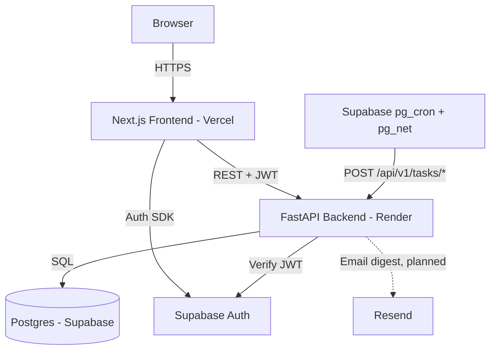
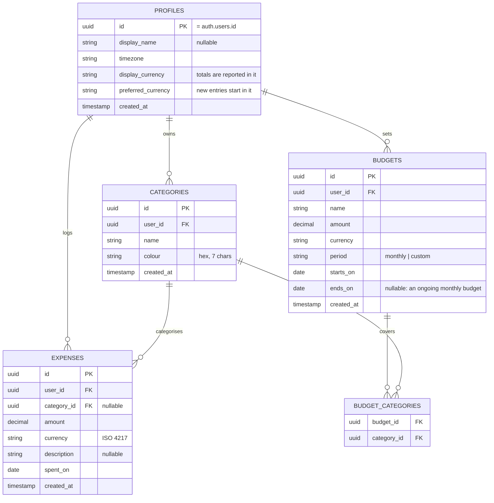

# Developer Guide — Ultimate Tracker

This document is the technical reference for building Ultimate Tracker. Read this before writing code.

## Table of Contents

1. [Architecture Overview](#1-architecture-overview)
2. [Tech Stack & Rationale](#2-tech-stack--rationale)
3. [Repository Structure](#3-repository-structure)
4. [Domain Model & Database Schema](#4-domain-model--database-schema)
5. [API Design Conventions](#5-api-design-conventions)
6. [Features & Functional Requirements](#6-features--functional-requirements)
7. [Local Development Setup](#7-local-development-setup)
8. [Branching Strategy & Git Workflow](#8-branching-strategy--git-workflow)
9. [CI/CD Pipeline](#9-cicd-pipeline)
10. [Testing Strategy](#10-testing-strategy)
11. [Coding Standards & Linting](#11-coding-standards--linting)
12. [Observability & Monitoring](#12-observability--monitoring)
13. [Security Notes](#13-security-notes)
14. [Release Plan](#14-release-plan)
15. [Future Considerations](#15-future-considerations)

---

## 1. Architecture Overview

Ultimate Tracker is a **decoupled web app**: a Next.js frontend talks to a FastAPI backend over REST, and both rely on Supabase for Postgres and authentication.


```mermaid
graph TD
    A[Browser] -->|HTTPS| B[Next.js Frontend - Vercel]
    B -->|REST + JWT| C[FastAPI Backend - Render]
    C -->|SQL| D[(Postgres - Supabase)]
    B -->|Auth SDK| E[Supabase Auth]
    C -->|Verify JWT| E
    F[Supabase pg_cron + pg_net] -->|POST /api/v1/tasks/*| C
    C -.->|Email digest, planned| H[Resend]
```

Solid lines exist today; dotted ones are planned. The scheduler is the database's own cron
calling the backend's job endpoints (see [platform.md](./docs/features/platform.md#background-jobs)).
There is no error-reporting service, by choice (see [§12](#12-observability--monitoring)), and no email channel yet.

**Why decoupled instead of Next.js full-stack (API routes)?**
Because FastAPI gives you async-native Python, automatic OpenAPI docs, and a clean place to put the correlation engine and scheduled jobs — logic that doesn't belong wedged into Next.js API routes. It also mirrors how most real backend teams are structured, which matters for a portfolio piece.

**Auth flow:**
1. User signs up/logs in via Supabase Auth SDK in the frontend.
2. Supabase issues a JWT.
3. Frontend attaches the JWT as a Bearer token on every request to FastAPI.
4. FastAPI verifies the JWT against Supabase's public key (no separate auth database needed).
5. Rejections are uniform: `401` with `MISSING_TOKEN` (no/!Bearer header) or `INVALID_TOKEN`
   (bad signature, expired, wrong audience or issuer, unusable subject), always with a
   `WWW-Authenticate: Bearer` header. If the JWKS endpoint itself is unreachable the answer is
   `503 AUTH_UNAVAILABLE` — an outage must not look to the client like a bad token.

---

## 2. Tech Stack & Rationale

| Choice | Rationale |
|---|---|
| **Next.js 16 (App Router)** | Server components reduce client JS, good defaults for SEO and load speed |
| **TypeScript** everywhere on frontend | Catches schema mismatches with the API at compile time |
| **Tailwind CSS 4 + theme tokens** | Every colour is a CSS variable in `app/globals.css`, so eight colour schemes and dark mode share one set of hand-written components; no component library |
| **FastAPI** (Python 3.14) | Async-first, Pydantic validation built in, auto-generated OpenAPI docs at `/docs` |
| **SQLAlchemy 2.0 (async) + Alembic** | Explicit migrations, no magic — important when the schema spans five domains |
| **Supabase (Postgres + Auth)** | Free tier is generous (500MB DB, 50k monthly active users), removes the need to build auth from scratch |
| **Render (backend)** | Free tier supports Docker deploys; spins down after inactivity but wakes on request — acceptable for a personal project |
| **Vercel (frontend)** | Zero-config Next.js deploys, generous free tier, preview deployments per PR |
| **GitHub Actions** | Free for public repos, native PR integration |
| **structlog** | Log calls carry named fields; deployments render them as one JSON object per line, so Render's log search can filter by them. No error-reporting service on top: the users are the author and a few friends |
| **Supabase pg_cron + pg_net** | The scheduler: the database's cron POSTs to idempotent job endpoints, so there is no worker process to host |

---

## 3. Repository Structure

```
ultimate-tracker/
├── frontend/
│   ├── app/
│   │   ├── (auth)/login/    # public — no session required
│   │   ├── (auth)/signup/
│   │   ├── (app)/           # signed-in routes; layout.tsx wraps them in AuthGuard
│   │   │   ├── dashboard/
│   │   │   ├── finance/     # Overview, expenses/ (Transactions), budgets/, subscriptions/, categories/
│   │   │   ├── fitness/     # ComingSoon placeholders until each domain ships
│   │   │   ├── time/
│   │   │   ├── insights/
│   │   │   ├── gaming/
│   │   │   ├── notifications/
│   │   │   ├── profile/
│   │   │   ├── settings/
│   │   │   └── onboarding/  # placeholder
│   │   ├── page.tsx         # public welcome page
│   │   └── globals.css      # theme tokens (generated) + Tailwind 4 config
│   ├── components/
│   │   ├── finance/         # one folder per domain
│   │   ├── home/  notifications/  profile/  settings/
│   │   ├── shared/          # app shell, nav, auth guard, Log menu
│   │   ├── charts/          # empty for now; charts live with their domain
│   │   └── ui/              # empty for now; no component library is used
│   ├── lib/
│   │   ├── api-client.ts    # typed fetch wrapper for FastAPI
│   │   ├── supabase.ts
│   │   ├── types/           # API response shapes
│   │   └── hooks/
│   ├── tests/
│   ├── package.json
│   └── postcss.config.mjs    # Tailwind 4 is configured in app/globals.css, not a JS config
│
├── backend/
│   ├── app/
│   │   ├── api/
│   │   │   └── v1/
│   │   │       ├── health.py         # liveness check, not a domain
│   │   │       ├── auth.py           # /auth/me profile
│   │   │       ├── notifications.py
│   │   │       ├── tasks.py          # job triggers, X-Task-Secret instead of a JWT
│   │   │       ├── finance.py
│   │   │       ├── fitness.py        # empty stubs until their domains ship
│   │   │       ├── time_tracking.py
│   │   │       ├── insights.py
│   │   │       └── gaming.py
│   │   ├── core/             # config, JWT verification, currencies, timezones
│   │   ├── db/                # session, base model
│   │   ├── models/             # SQLAlchemy ORM models
│   │   ├── schemas/            # Pydantic request/response schemas
│   │   ├── services/           # business logic; services/finance/ is split per resource
│   │   ├── tasks/               # the background jobs (exchange rates, subscriptions) + CLI runner
│   │   └── main.py
│   ├── alembic/
│   │   └── versions/
│   ├── scripts/
│   │   └── schedule_jobs.sql   # pg_cron + pg_net setup, run once in Supabase
│   ├── tests/                  # unit/ and integration/ (Postgres, via TEST_DATABASE_URL)
│   ├── requirements.txt
│   ├── Dockerfile
│   └── pyproject.toml          # ruff + mypy config
│
├── docs/
│   ├── features/               # per-domain feature specifications — the spec source of truth
│   └── adr/                    # architecture decision records
├── .github/
│   ├── workflows/
│   │   ├── backend-ci.yml
│   │   ├── frontend-ci.yml
│   │   └── pr-title.yml        # Conventional Commits check on PR titles
│   ├── ISSUE_TEMPLATE/         # bug / feature / chore issue forms
│   ├── pull_request_template.md
│   └── dependabot.yml
├── docker-compose.yml
├── .pre-commit-config.yaml
├── README.md
├── CONTRIBUTING.md
└── DeveloperGuide.md
```

Env files are per app — `backend/.env` and `frontend/.env.local`, each copied from the
`.env.example` beside it. There is no root `.env`.

> There is no `deploy.yml` — Render and Vercel deploy natively on push to `main`. Don't re-add one.

**Pattern for adding a new domain feature:** model → schema → service → API route → test. Always in that order. Never write business logic directly in a route handler — it belongs in `services/`.

---

## 4. Domain Model & Database Schema


Two things to know before reading any of this:

1. **The tables that exist today are Finance, Profiles, and two platform tables —
   `notifications` and `exchange_rates` — and nothing else.** Everything under
   [Planned tables](#planned-tables) is specified but unbuilt.
2. **`profiles` mirrors Supabase `auth.users` by UUID.** Auth data is never duplicated — the
   local table holds only app-specific fields.

### What exists today


```mermaid
erDiagram
    PROFILES ||--o{ CATEGORIES : owns
    PROFILES ||--o{ EXPENSES : logs
    PROFILES ||--o{ BUDGETS : sets
    CATEGORIES ||--o{ EXPENSES : categorises
    BUDGETS ||--o{ BUDGET_CATEGORIES : covers
    CATEGORIES ||--o{ BUDGET_CATEGORIES : covered_by

    PROFILES {
        uuid id PK "= auth.users.id"
        string display_name "nullable"
        string timezone
        string display_currency "totals are reported in it"
        string preferred_currency "new entries start in it"
        timestamp created_at
    }
    CATEGORIES {
        uuid id PK
        uuid user_id FK
        string name
        string colour "hex, 7 chars"
        timestamp created_at
    }
    EXPENSES {
        uuid id PK
        uuid user_id FK
        uuid category_id FK "nullable"
        decimal amount
        string currency "ISO 4217"
        string description "nullable"
        date spent_on
        timestamp created_at
    }
    BUDGETS {
        uuid id PK
        uuid user_id FK
        string name
        decimal amount
        string currency
        string period "monthly | custom"
        date starts_on
        date ends_on "nullable: an ongoing monthly budget"
        timestamp created_at
    }
    BUDGET_CATEGORIES {
        uuid budget_id FK
        uuid category_id FK
    }
```

Three properties of this schema are easy to get wrong:

- **Expenses, not transactions.** The domain is expense-only. There is no `type` column with
  `income|expense`, and no `payment_method`.
- **Budgets come in two kinds** (`period`): **monthly**, a fresh cap each calendar month from
  `starts_on`'s month until `ends_on`'s (or for good), and **custom**, one cap over a fixed
  range. Monthly ones reset by calculation, not by a job — see
  [finance.md](./docs/features/finance.md#budgets). Either kind applies to **many categories**
  through `budget_categories`; code that assumes one category per budget is wrong.
- **Every amount carries its own currency.** Summing raw amounts across rows is meaningless.
  Conversion into the user's `display_currency` happens server-side in `services/finance/summaries.py`.

Not drawn above: `subscriptions` ([finance.md](./docs/features/finance.md#subscriptions)),
`exchange_rates`, one USD-based rate per currency, refreshed daily and doubling as the list of supported currencies, that no other table references
([finance.md](./docs/features/finance.md#exchange-rates)), and `notifications`, one row per in-app
message, keyed to `profiles` ([platform.md](./docs/features/platform.md#notifications)).

### Planned tables

Specified in [`docs/features/`](./docs/features/), not yet built. Each links to the document that
defines its columns and behaviour.

| Domain | Tables | Spec |
|---|---|---|
| Fitness | `training_sessions`, `training_set_entries`, `step_logs`, `sleep_logs`, `mood_checkins`, `habits`, `habit_logs` | [fitness.md](./docs/features/fitness.md#data-model) |
| Time & Calendar | `time_sessions`, `entertainment_allowances`, `events`, `calendar_connections` | [time-and-calendar.md](./docs/features/time-and-calendar.md#data-model) |
| Insights | `weekly_digests`, `correlations` | [insights.md](./docs/features/insights.md#data-model) |
| Platform | `notification_preferences` | [platform.md](./docs/features/platform.md#notifications) |

Add a table to this list in the same PR that creates its migration. A schema section that lags
the database is how the previous version of this document ended up describing tables that were
never built.


---

## 5. API Design Conventions

- All routes are versioned: `/api/v1/...`
- Resource-based REST naming: `GET /api/v1/finance/expenses`, `POST /api/v1/finance/expenses`, `PATCH /api/v1/finance/expenses/{id}`
- Auth: every protected route requires `Authorization: Bearer <supabase_jwt>`. The exceptions are `/health`, `/finance/currencies` (identical for everyone), and `/tasks/*`, which take an `X-Task-Secret` header instead
- Pagination: offset-based, `?limit=&offset=`, on lists that grow — today `GET /finance/expenses` (default 100, max 500), with a total order (`spent_on`, `created_at`, `id`) so pages never repeat or skip a row. `GET /notifications` takes `?limit=` only
- An action that is not plain CRUD, or that needs a large body, is a `POST` on a sub-path: `POST /finance/expenses/export` takes the ids to export and returns an `.xlsx`
- Standard error shape:

```json
{
  "error": {
    "code": "BUDGET_NOT_FOUND",
    "message": "No budget exists for this category and period."
  }
}
```

- Dates always ISO 8601, timezone-aware. Server stores UTC; frontend converts to user's stored timezone for display.
- Every domain has a corresponding Pydantic schema split into `Create`, `Update`, and `Read` variants — never reuse one schema for all three.

---

## 6. Features & Functional Requirements


**The per-domain specifications live in [`docs/features/`](./docs/features/).** They are the
source of truth for what each domain must do; this section is only the map.

Keeping the detail in one place is deliberate. The previous version of this guide carried a full
feature list here *and* implied one in the README, and the two drifted apart until neither
matched the code.

### The five domains, in order

| # | Domain | Scope | Release | Spec |
|---|---|---|---|---|
| 1 | Finance & Budgeting | `finance` | v0.1, subscriptions v0.2 | [finance.md](./docs/features/finance.md) |
| 2 | Fitness | `fitness` | v0.2–v0.3 | [fitness.md](./docs/features/fitness.md) |
| 3 | Time Tracking & Calendar | `time` | v0.2–v0.3 | [time-and-calendar.md](./docs/features/time-and-calendar.md) |
| 4 | Cross-Domain Insights | `insights` | v0.3 | [insights.md](./docs/features/insights.md) |
| 5 | Gaming Performance | `gaming` | last | [gaming.md](./docs/features/gaming.md) |
| — | Platform & Core | `auth`, `dashboard`, `api`, `db`, `ci` | v0.1, ongoing | [platform.md](./docs/features/platform.md) |

**This order is load-bearing.** It is the sidebar order, the README order, and the build order.

### Three structural decisions

**Steps, Fitness and Wellness are one domain.** They used to be three. Sleep, mood and training
are one story about one body, and splitting them across three pages meant the app could not ask
the only interesting question — how they move together — without a fourth page to join them back
up. "Wellness" in particular was not a category but a leftover drawer for everything that fitted
nowhere else. The merged domain is called **Fitness**, which reads slightly narrow, because
`/api/v1/health` is the liveness check and cannot mean two things. Reasoning in
[fitness.md](./docs/features/fitness.md#why-this-is-one-domain-not-three).

**Time Tracking also owns the calendar.** Tracking hours already spent answers half the question;
the other half is what you have committed to. Both are the same resource, and only a domain
holding both can tell you a week was over-committed before it started. This brings a two-way
Google Calendar sync into scope — the only feature in the app that writes to a system outside it,
and correspondingly the one with the strictest rules. See
[time-and-calendar.md](./docs/features/time-and-calendar.md#two-way-sync-is-the-hard-part).

**Gaming Performance is last, deliberately.** It is the most interesting domain to build, which
is exactly why it is scheduled after everything else — left available, it is what gets built
instead of the budget CRUD. See [gaming.md](./docs/features/gaming.md#why-this-one-is-last).


---

## 7. Local Development Setup

1. Create a free Supabase project at [supabase.com](https://supabase.com).
2. Copy each app's example env file — note the frontend's is `.env.local`:
   - `backend/.env.example` → `backend/.env`: `DATABASE_URL` (Supabase connection string with the
     `postgresql+asyncpg://` scheme) and `SUPABASE_JWKS_URL`; `TASK_SECRET` if you want to call
     the job endpoints
   - `frontend/.env.example` → `frontend/.env.local`: `NEXT_PUBLIC_SUPABASE_URL`,
     `NEXT_PUBLIC_SUPABASE_ANON_KEY`
3. Install dependencies: a virtualenv plus `pip install -r requirements.txt` in `backend/`, and
   `npm install` in `frontend/` — the exact commands are in the
   [README](./README.md#getting-started).
4. In `backend/`, run the migrations, then start the API (it keeps this terminal):
   `python -m alembic upgrade head`, then `python -m uvicorn app.main:app --reload`
5. In a second terminal, in `frontend/`: `npm run dev`
6. Visit `http://localhost:3000` and sign up. Your profile and a starter set of categories are
   created on first sign-in — there is no seed script.
7. Optional, in `backend/`: load real exchange rates once, or the currency pickers offer only
   the 10 fallback currencies: `python -m app.tasks exchange-rates`.

Use `python -m` for every Python tool: Windows Smart App Control blocks the unsigned
`uvicorn.exe` / `alembic.exe` / `pytest.exe` shims in `.venv/Scripts/` (see the README).

Or run `docker compose up --build` from the repo root to start both. Compose reads the same two
env files and has no database of its own, so `DATABASE_URL` must point somewhere the container
can reach — `localhost` there is the container.

**Scheduling the jobs in production** is a one-off: run
[`backend/scripts/schedule_jobs.sql`](./backend/scripts/schedule_jobs.sql) in the Supabase SQL
editor with the Render URL and `TASK_SECRET` filled in.

---

## 8. Branching Strategy & Git Workflow

- **`main`** is always deployable. No direct commits — every change goes through a PR. This is enforced by a branch ruleset, not just convention.
- Branch naming: `feat/finance-budget-alerts`, `fix/step-log-timezone-bug`, `chore/update-deps`
- Commit messages follow **Conventional Commits**: `feat:`, `fix:`, `refactor:`, `test:`, `docs:`, `chore:`, `ci:`, `perf:`, `style:`
- Even working solo: open a PR for every feature, let CI run, then merge. This keeps history clean and forces the test suite to actually run before code lands on `main`.
- Squash merge into `main` to keep a linear, readable history. **Because merges are squashed, the PR title becomes the commit message** — so the PR title is what `pr-title.yml` lints, not the individual commits.

**Ruleset on `main`** (Settings → Rules → Rulesets): restrict deletions, block force pushes,
require a PR, require the `backend-ci-ok` and `frontend-ci-ok` status checks, require branches
to be up to date, require linear history.

Day-to-day workflow, PR sizing, label scheme, and the migration rules live in
[`CONTRIBUTING.md`](./CONTRIBUTING.md).

---

## 9. CI/CD Pipeline

Three CI workflows. Deployment is handled natively by Render and Vercel (auto-deploy on push to `main`), not by a GitHub Actions job:

**`backend-ci.yml`** — when a PR touches `backend/`:
1. Install dependencies
2. Run `ruff check`, `ruff format --check`, and `mypy`
3. Run migrations against a Postgres service, then guard them: `alembic check` (models must not drift from migrations), a single-head check, and a `downgrade base` → `upgrade head` round trip to prove reversibility
4. Run `pytest` with coverage
5. Build Docker image (no push, just validate it builds)

**`frontend-ci.yml`** — when a PR touches `frontend/`:
1. Install dependencies
2. Run `eslint`, `prettier --check`, and `tsc --noEmit`
3. Run `npm run test`
4. Run `npm run build` to catch build-time errors

**`pr-title.yml`** — on every PR: lints the title against Conventional Commits, since squash merging makes the title the commit message on `main`.

**Why the workflows aren't path-filtered at the top level:** a workflow with a `paths:` filter
that doesn't trigger reports *no status at all*, so requiring it as a status check would leave
frontend-only PRs waiting forever on `backend-ci`. Instead each workflow has a `changes` job
that does the filtering via `dorny/paths-filter`, gating the real job with an `if:`, plus a
`backend-ci-ok` / `frontend-ci-ok` job that always runs and reports the outcome. **Those gate
jobs are the required status checks.**

**Dependency updates:** Dependabot (`.github/dependabot.yml`) opens grouped weekly PRs for pip, npm, GitHub Actions, and Docker. npm splits majors into their own group; pip is one group, because `requirements.txt` holds ranges with no lock file and Dependabot cannot classify a bump as major or minor. Security alerts are separate from these PRs; GitHub's preset auto-triage rule (on by default for public repositories) dismisses low-impact alerts on development-only dependencies as soon as they are raised.

**Deployment (no workflow needed):**
- **Backend** — Render auto-deploys on push to `main`: it rebuilds the Docker image and restarts the service.
- **Frontend** — Vercel auto-deploys `main` to production and every PR to a preview, via its GitHub integration.
- **Migrations** — run manually when the schema changes (`alembic upgrade head` against the production database). There is no auto-migrate on deploy; Render's pre-deploy command can automate this on paid instance types.

> ⚠️ **Ordering matters.** Render redeploys the backend the instant a PR merges, but migrations
> don't run themselves. Merging code that expects a new column before that column exists takes
> production down. Always apply additive migrations to prod **before** merging the code that
> uses them, and split destructive changes expand → contract across two PRs. See
> [`CONTRIBUTING.md` § Database migrations](./CONTRIBUTING.md#database-migrations).

Every PR also gets a Vercel preview deployment automatically — useful for visually checking frontend changes before merge.

---

## 10. Testing Strategy

| Layer | Tool | Target |
|---|---|---|
| Backend unit tests | Pytest | Service layer logic (budget calculations, correlation thresholds, overload detection) |
| Backend integration tests | Pytest + httpx AsyncClient | Full API request/response cycles against Postgres (`TEST_DATABASE_URL`): the schema is built once per run by `alembic upgrade head` and every table is emptied before each test. Postgres rather than SQLite because the guarantees that matter — a renewal charged once under overlapping runs (`SKIP LOCKED`), exact decimals — only exist there |
| Frontend unit tests | Vitest + React Testing Library | Components and hooks |
| Frontend E2E (from v0.3) | Playwright | Critical flows: signup → onboarding → log a transaction → see it on dashboard |

Minimum bar: every new service function and API endpoint needs at least one test before merging. Aim for meaningful coverage of business logic (budget math, correlation engine, overload detection) over UI snapshot tests.

---

## 11. Coding Standards & Linting

**Backend (Python):**
- `ruff check` for linting and `ruff format` for formatting (replaces Black + Flake8 + isort) — both enforced in CI
- `mypy` in strict mode (`pyproject.toml`) — all functions require type hints. CI checks `app/` only; `tests/` is not type-checked
- Line length 100 (`pyproject.toml`)
- Naming: `snake_case` for functions/variables, `PascalCase` for classes/Pydantic models

**Frontend (TypeScript):**
- `eslint` (`next/core-web-vitals`) for correctness, `prettier` for formatting — `eslint-config-prettier` disables the rules that would conflict
- Both enforced in CI via `npm run lint` and `npm run format:check`; fix locally with `npm run format`
- Print width 100, single quotes, semicolons (`.prettierrc`)
- Strict TypeScript (`strict: true` in `tsconfig.json`)
- Naming: `camelCase` for variables/functions, `PascalCase` for components, files match component names

**Both languages:** `.pre-commit-config.yaml` runs ruff check, ruff format, and prettier on
staged files, plus `detect-private-key` and friends — ruff at the version CI installs, prettier
from `frontend/node_modules`. Install with `python -m pre_commit install` (setup in
[CONTRIBUTING.md](./CONTRIBUTING.md#local-setup)) — optional, but it catches these before CI does.

**General:**
- No `any` types without a comment explaining why
- No commented-out code in commits — delete it, git history keeps it
- Every API endpoint must have a corresponding Pydantic schema, never raw dicts

---

## 12. Observability & Monitoring

Logging is set up in [`app/core/observability.py`](./backend/app/core/observability.py) when the
app starts, and follows `ENVIRONMENT`: `development` (the default) and `test` are local;
anything else, `production` on Render, is a deployment.

- **Logging** *(built)*: the backend logs through `structlog` with event names and key-value
  fields (`logger.warning("exchange_rates.stale", age_hours=50)`). Deployments print one JSON
  object per line — `event`, `level`, an ISO `timestamp` in UTC, the fields, and `exception`
  with the traceback — so Render's log search can filter on any field. Locally the same
  lines print as coloured text. Debug lines are dropped. Uvicorn's own access log is
  unchanged.
- **No error-reporting service** *(by choice)*: no Sentry or similar. The users are the
  author and a few friends, who see a failure on screen when it happens. What nobody
  watches is the scheduled jobs; a failed run is a `level: error` line in Render's logs,
  and pg_cron's own history (`cron.job_run_details`, `net._http_response`) shows what
  each call answered. Revisit only if the app gains users who would not report a bug.
- **Health check** *(built)*: `GET /api/v1/health` returns `{"status": "ok", "db": "connected"}`
  — used by Render and an uptime monitor. It answers 200 with `"db": "disconnected"` when the
  database is down, so a monitor has to read the body, not just the status code.
- **Uptime monitoring**: UptimeRobot (free tier) pings the health check every 5 minutes, alerts via email if down
- **Metrics** (optional, v0.4+): basic request latency logging per endpoint, reviewed manually rather than a full Prometheus/Grafana stack — overkill for a personal project's scale

---

## 13. Security Notes

- Never commit `.env` files — `.gitignore` already excludes them, verify before every commit
- JWT verification happens on every protected backend route using Supabase's public JWKS endpoint — never trust a JWT without verifying its signature
- Secrets live in Render/Vercel environment settings (and Supabase Vault for the scheduler) — never in code. Today that is `DATABASE_URL` and `TASK_SECRET` on Render; `ENVIRONMENT=production` is set there too, though it is not a secret; a Resend API key joins them when email lands. GitHub Actions secrets hold only the public `NEXT_PUBLIC_*` values for CI builds, with placeholders when they are absent. No Supabase service role key is used anywhere
- Sign-up and log-in go straight to Supabase Auth, so brute-force protection is Supabase's built-in rate limiting; the backend has no auth endpoints of its own to limit
- `/api/v1/tasks/*` is not behind a user JWT: it compares `X-Task-Secret` to `TASK_SECRET` in constant time, and answers `503` with every job disabled while `TASK_SECRET` is unset
- CORS: backend only accepts requests from the deployed frontend origin and `localhost` in dev

---

## 14. Release Plan


**There are no dates on this plan, by design.** An earlier version committed to 18 weeks with a
release every 4. That estimate was wrong by a wide margin, and a schedule that is known to be
wrong is worse than no schedule: it turns every honest week into a missed deadline and pushes
toward shipping something half-built to hit a number nobody outside this repo cares about.

What matters is the order and the definition of done. A release ships when it is done and the one
before it is stable.

| Release | Scope | Definition of Done |
|---|---|---|
| **v0.1** | Auth, Finance core (expenses, categories, multi-currency budgets, spending dashboard), app shell, theming, CI/CD | Deployed to Vercel and Render; an expense can be logged and shows up converted in the dashboard; CI green on every PR |
| **v0.2** | Subscriptions end to end including reminders, notification + scheduler service, budget breach alerts, Fitness training and steps, focus timer and entertainment budgets | A subscription reminds three days out and renews itself into a real expense; a budget breach notifies; a workout and a step count can be logged |
| **v0.3** | Two-way Google Calendar sync and events, sleep/mood/habits, correlation engine, weekly digest, onboarding | An event created in the app appears in Google and survives a round trip; the correlation engine surfaces one real pattern from actual data; the digest sends |
| **v0.4** | Polish, performance pass, full observability, public launch | No `level: error` lines in the logs across a full week of real use; onboarding under three minutes for someone new |
| **Last** | Gaming Performance — manual logging, Riot and Steam integration, tilt detection | Match history syncs and at least one gaming correlation appears in the insights dashboard |

**Where it stands:** v0.1 is done. Ahead of v0.2, subscriptions with reminders, in-app
notifications and the scheduler (pg_cron) have shipped as well; budget breach alerts, Fitness
training and steps, and the focus timer are what remain of v0.2.

**The scheduler moved from v0.3 to v0.2.** Subscription reminders are the first feature that
cannot work without it, and budget alerts and the weekly digest then reuse the same service
rather than each growing their own.


---

## 15. Future Considerations

- **Android companion app** — explicitly out of scope for this project. If automatic step/app-usage tracking becomes a priority later, it would be a separate project consuming this backend's API.
- **Gaming performance domain** — Riot/Steam API integration is well-scoped but deferred past v0.4 to keep the core product tight.
- **Multi-user / social features** (leaderboards, shared habits) — not planned; this is intentionally a single-user tool.
- **Native mobile web app (PWA)** — worth revisiting once the core product is stable; would give an installable icon and offline support without building a separate native app.
